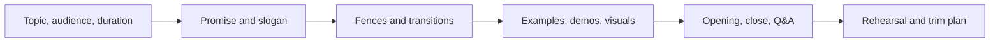

# TalkCraft

[](./talkcraft)
[](./talkcraft)
[](./talkcraft)
[](./talkcraft/references/framework.md)

TalkCraft helps an agent turn rough presentation material into a clear, teachable talk plan before slides start getting in the way. The workflow is inspired by Patrick Winston's presentation framework and tuned for Codex, Claude, and similar assistants that need structure, pacing, and rehearsal discipline rather than generic slide filler.

## About

TalkCraft packages Patrick Winston's presentation principles into a practical repository that other people can clone, install, and use quickly. Use it when the work matters: keynotes, thesis defenses, demos, technical briefings, pitch decks, or any talk where the argument needs to land cleanly under time pressure.

Instead of starting with decoration, TalkCraft starts with the promise of the talk, breaks the narrative into fences, assigns evidence to each section, and finishes with rehearsal support. That makes it useful not only for writing a new talk, but also for auditing a weak deck and rescuing it fast.



## What TalkCraft Produces

TalkCraft stays practical. A good run should leave you with a sharper promise, a cleaner section plan, a better opening, a stronger ending, and fewer weak slides pretending to do argumentative work.

**Typical outputs**

- A one-line promise and governing idea
- A fence-by-fence structure with transitions
- An evidence plan for stories, examples, demos, or visuals
- A slide plan when you need deck-ready direction
- Rehearsal notes, trim plans, and likely Q&A

## Install

Choose the path that matches how you work.

### macOS / Linux

```bash
git clone https://github.com/mahdisanagostar/talkcraft.git
mkdir -p ~/.codex/skills && cp -R talkcraft/talkcraft ~/.codex/skills/
# For Claude, replace ~/.codex with ~/.claude
```

### Windows (PowerShell)

```powershell
git clone https://github.com/mahdisanagostar/talkcraft.git
New-Item -ItemType Directory -Force "$HOME\.codex\skills" | Out-Null; Copy-Item -Recurse .\talkcraft\talkcraft "$HOME\.codex\skills\"
# For Claude, replace .codex with .claude
```

### Chef

```bash
chef pack-enable --project . --pack media --offline
```

## Use It Well

The fastest way to get value from TalkCraft is to give the agent three concrete things up front: audience, time limit, and objective. From there, choose the right mode.

**Design**

Use this when you have a topic but not a talk yet.

**Audit**

Use this when the deck already exists but the structure feels loose or forgettable.

**Rewrite**

Use this when the content matters, but the order, pacing, and transitions do not.

**Rehearse**

Use this when the talk already works on paper and now needs trimming, recovery moves, and likely Q&A.

## Quick Start

Start with the repository root.

```bash
python3 talkcraft/scripts/quick_validate.py
python3 talkcraft/scripts/audit_outline.py talkcraft/assets/presentation-brief-template.md
```

If you want a realistic first run, hand the agent a short brief and ask for one of these:

- "Design a 12-minute technical talk for senior engineers."
- "Audit this thesis defense outline using TalkCraft."
- "Rewrite this deck around a clearer Patrick Winston style promise."
- "Prepare rehearsal notes and a trim plan for this demo."

## Keep Chef Mirror In Sync

If you also maintain the Chef copy, the repository already includes a small sync helper.

```bash
python3 talkcraft/scripts/sync_mirror.py --mode check
python3 talkcraft/scripts/sync_mirror.py --mode sync
```

If the Chef checkout lives somewhere else, point to it explicitly:

```bash
TALKCRAFT_MIRROR=path/to/chef/adapters/shared/skills/talkcraft \
python3 talkcraft/scripts/sync_mirror.py --mode check
```

## Resources

- [Skill definition](./talkcraft/SKILL.md)
- [Presentation brief template](./talkcraft/assets/presentation-brief-template.md)
- [Slide plan template](./talkcraft/assets/slide-plan-template.md)
- [Rehearsal checklist](./talkcraft/assets/rehearsal-checklist.md)
- [Framework notes](./talkcraft/references/framework.md)
- [Rubric](./talkcraft/references/rubric.md)
- [Agent compatibility notes](./talkcraft/references/agent-compatibility.md)
- [Outline auditor](./talkcraft/scripts/audit_outline.py)
- [Validation wrapper](./talkcraft/scripts/quick_validate.py)
- [Mirror sync helper](./talkcraft/scripts/sync_mirror.py)
